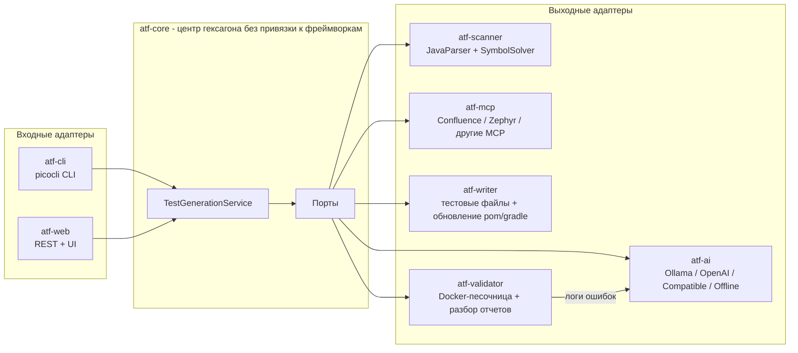

# AutoTestForge

**Генератор модульных и интеграционных тестов для Java-проектов на базе ИИ.**

AutoTestForge сканирует любой Maven- или Gradle-проект, анализирует исходный код на уровне AST и с помощью LLM генерирует осмысленные, готовые к запуску тесты JUnit 5 — включая моки Mockito, проверки AssertJ, позитивные и негативные сценарии, а также граничные случаи. Сгенерированные тесты можно выполнить в изолированной Docker-песочнице; ошибки передаются обратно модели для автоматического самоисправления.


## Как это работает



Пайплайн для каждого подходящего класса:

1. **Сканирование** — рекурсивно найти все корни `src/main/java` (с учетом multi-module-проектов), разобрать каждую единицу компиляции через JavaParser + SymbolSolver, извлечь публичный API, Javadoc, аннотации, зависимости класса и граф зависимостей внутри проекта.
2. **Внешний контекст** *(опционально)* — запросить бизнес-правила, требования и TMS test cases из настроенных MCP-источников (например, Confluence и Zephyr) по имени класса, package, методам и пользовательскому query template.
3. **Промпт** — собрать самодостаточный промпт: полный исходный код класса, сигнатуры методов с Javadoc, зависимости для мокирования, внешний бизнес/TMS-контекст, ограничения по стилю (Arrange-Act-Assert, именование `method_shouldX_whenY`, граничные случаи, сценарии ошибок).
4. **Генерация** — вызвать настроенную LLM через LangChain4j; ответы повторяются с экспоненциальной задержкой и проверяются JavaParser. Эта проверка подтверждает синтаксис Java; компиляция и поведение проверяются на шаге валидации.
5. **Запись** — поместить тест в `src/test/java/<package>/<Class>Test.java` соответствующего модуля и добавить недостающие тестовые зависимости в `pom.xml` / `build.gradle` / `build.gradle.kts`.
6. **Валидация и самоисправление** *(опционально)* — запустить тест во временном Docker-контейнере (Testcontainers); при ошибке разобрать JUnit XML-отчет, отправить ошибки обратно в LLM и повторить до `max-fix-attempts` раз. Если Docker daemon недоступен, используется локальный запуск процесса.

Ошибка в одном классе никогда не прерывает весь запуск — она записывается в итоговый отчет.

## Модули

| Модуль | Роль |
|---|---|
| `atf-core` | Доменная модель, порты и сервис оркестрации. Без зависимостей от фреймворков. |
| `atf-scanner` | Адаптер `ProjectScannerPort` на базе JavaParser (AST + разрешение символов). |
| `atf-ai` | Проектирование промптов, Ollama / OpenAI / OpenAI-compatible API, разбор ответов, резервный автономный генератор. |
| `atf-mcp` | Подключение внешнего бизнес- и TMS-контекста через stdio MCP-серверы (например, Confluence, Zephyr). |
| `atf-writer` | Запись тестовых файлов, `MavenPomUpdater` (Maven model API), `GradleBuildUpdater`. |
| `atf-validator` | Исполнитель тестов в Docker (Testcontainers), резервный запуск в локальном процессе, парсер JUnit XML-отчетов. |
| `atf-cli` | Интерфейс командной строки на Spring Boot + picocli. |
| `atf-web` | Spring Boot REST API + одностраничный интерфейс с отображением прогресса в реальном времени. |

## Быстрый старт

Основной сценарий: скачать проект, запустить сайт на рабочем компьютере, выбрать в форме способ подключения LLM и указать Java-проект. **AutoTestForge не запускает и не скачивает саму LLM**: он подключается к уже доступному серверу. Qwen может обслуживаться через Ollama или через OpenAI-compatible API — выбор доступен на сайте.

Для запуска из исходников нужны **JDK 17+ и Maven 3.9+**. Укажите JDK в `JAVA_HOME`, Maven добавьте в `PATH` или передайте путь скрипту. Первый запуск скачивает Maven-зависимости, поэтому на работе может потребоваться корпоративный Maven mirror/proxy в `~/.m2/settings.xml`. Скрипты не устанавливают Java, Maven и модели. Альтернатива без локальных Java/Maven — Docker Compose ниже.

### Windows: запуск сайта

Откройте PowerShell в каталоге скачанного проекта:

```powershell
.\launch-web.ps1

# Разрешить сайту работать также с проектами в C:\Work\Projects:
.\launch-web.ps1 -ProjectRoot 'C:\Work\Projects'

# Проверить установленные инструменты, если их нет в PATH:
.\launch-web.ps1 -JavaHome 'C:\Tools\jdk-17' -MavenHome 'C:\Tools\apache-maven-3.9.9' -Check
```

Если Maven поставляется вместе с IntelliJ IDEA, `-MavenHome` может указывать на `<каталог IDEA>\plugins\maven\lib\maven3`. Переданные пути должны существовать; пробелы в них поддерживаются. Если выполнение скриптов запрещено политикой компьютера, используйте разрешенный компанией способ запуска PowerShell либо команды ручного запуска ниже.

Скрипт собирает сайт и запускает его в текущем окне. Откройте [http://localhost:8080](http://localhost:8080); для остановки нажмите `Ctrl+C`. После успешной сборки можно запускать с `-NoBuild`; после обновления исходников запустите без этого флага. Другой порт: `-Port 8081`. Одна команда запуска выполняется один раз и работает до остановки сервера; примеры выше — альтернативы.

### Linux / macOS

```bash
sh ./launch-web.sh
# Или с дополнительным каталогом рабочих проектов:
sh ./launch-web.sh --project-root "$HOME/work"
# Следующий запуск без повторной сборки:
sh ./launch-web.sh --no-build --project-root "$HOME/work"
```

Поддерживаются также `--java-home`, `--maven-home`, `--port` и `--check`. Сайт слушает только этот компьютер (`127.0.0.1`). По умолчанию разрешены проекты внутри каталога AutoTestForge; `-ProjectRoot` / `--project-root` добавляет доступ к указанному каталогу. Необходимые корни можно также задать переменной `ATF_ALLOWED_ROOTS` через запятую. Пути относятся к компьютеру, **где запущен сервер**, а не к браузеру.

### Первая проверка и подключение Qwen через сайт

1. Для первой проверки введите путь `examples/demo-project`, выберите `offline` и оставьте режим без записи включенным. Должен появиться результат для `PriceCalculator`. В этом режиме LLM и доступ к сети не нужны; содержательные тесты создаются только с LLM.
2. Выберите способ подключения в разделе LLM. Если на работе пока неизвестно, как запущен Qwen, запросите у администратора **тип API, базовый URL и точное имя модели**, а при необходимости ключ доступа.
3. Укажите URL, модель и ключ в форме. Запросите список моделей и проверьте подключение. Список может быть недоступен у корпоративного шлюза: в таком случае введите точное имя вручную и выполните проверку.
4. Укажите путь к рабочему Java-проекту и сначала запустите генерацию без записи. Для сохранения тестов отключите этот режим. Валидация запускает тесты и ограниченный цикл исправлений; для нее нужны инструменты сборки проекта или Docker.

| Способ на сайте | Что указать | Когда использовать |
|---|---|---|
| `Ollama` | Базовый адрес, например `http://localhost:11434`, и имя модели из списка | Qwen установлен в Ollama; удаленный сервер тоже поддерживается |
| `OpenAI-compatible` | Базовый адрес API, обычно с `/v1`, точное имя модели и ключ, если требуется | Корпоративный Qwen, vLLM, LM Studio, LocalAI или другой сервер с Chat Completions API |
| `OpenAI` | Имя модели и API-ключ | Официальный API OpenAI |
| `offline` | Подключение не требуется | Проверка сканирования и генерации простого smoke-теста без LLM |

Для OpenAI-compatible указывайте **базовый URL**, например `https://llm.company.example/v1`, а не полный путь `/chat/completions`. Названия `qwen2.5-coder:7b` (Ollama) и `qwen2.5-coder` (совместимый сервер) — примеры: доступное имя определяет ваш сервер. Поддержка «любой LLM» ограничена перечисленными API; произвольные собственные протоколы требуют отдельного адаптера.

URL, модель, таймаут, температура и API-ключ можно менять для каждого запуска без перезапуска сайта и редактирования файлов. Подключение OpenAI-compatible из формы не требует `ATF_COMPATIBLE_ENABLED=true`. Ключ LLM не сохраняется в браузерное хранилище и не возвращается в результатах задания. Если сервер уже настроен ключом через переменные окружения, пустое поле использует этот ключ только при неизменном endpoint. `ATF_API_TOKEN` — отдельный токен доступа к самому AutoTestForge; вводите его в поле авторизации сайта, если он задан.

### Ручная сборка и CLI

```bash
mvn verify
java -jar atf-web/target/atf-web-0.1.0.jar

# Сквозная проверка без LLM и без изменения demo-проекта:
java -jar atf-cli/target/atf-cli-0.1.0.jar generate \
    --project-path examples/demo-project --llm offline --dry-run
```

Для запуска web JAR с доступом к другим проектам в PowerShell:

```powershell
$env:ATF_ALLOWED_ROOTS = 'C:\Work\Projects'
java -jar atf-web/target/atf-web-0.1.0.jar
```

Опции CLI:

| Флаг | Значение |
|---|---|
| `--project-path, -p` | Корень целевого проекта (обязательно) |
| `--classes, -c` | Фильтр классов через запятую (простые или полные имена классов) |
| `--llm` | Переопределение провайдера на запуск: `ollama`, `openai`, `compatible`, `offline` |
| `--validate` | Запустить сгенерированные тесты в песочнице и самоисправить ошибки |
| `--dry-run` | Сгенерировать без изменения целевого проекта |
| `--max-fix-attempts` | Количество раундов самоисправления на класс (по умолчанию 2) |
| `--with-external-context` | Перед генерацией искать бизнес/TMS-контекст через настроенные MCP-источники |
| `--context-sources` | Ограничить источники контекста списком через запятую, например `confluence,zephyr` |
| `--context-query` | Переопределить поисковый шаблон MCP на запуск (`${className}`, `${fullyQualifiedName}`, `${packageName}`, `${projectPath}`, `${methods}`) |

### Веб-интерфейс

`POST /api/generation` запускает асинхронную задачу, `GET /api/generation/{id}` транслирует ее прогресс; встроенный одностраничный интерфейс делает это за вас и показывает журнал событий в реальном времени и таблицу результатов. Интерфейс также позволяет добавить несколько MCP-источников на конкретный запуск и загрузить XML/JSON/TXT файлы из Zephyr/TMS как контекст для LLM.

В запросе генерации объект `llmConnection` задает `provider`, `baseUrl`, `model`, `apiKey`, `timeoutSeconds` и `temperature`. `GET /api/llm/config` возвращает настройки без секретов, `POST /api/llm/models` принимает объект подключения и возвращает список моделей, `POST /api/llm/test` проверяет вызов модели. Эти endpoint защищены тем же `ATF_API_TOKEN`, что и генерация.

## Внешний контекст через MCP

AutoTestForge может обогащать промпты бизнес-информацией и тестовыми артефактами из внешних систем через stdio MCP-серверы. Это позволяет подключить, например, MCP-сервер Confluence для требований и MCP-сервер Zephyr для тест-кейсов из TMS. Каждый источник настраивается как команда запуска MCP-сервера и tool, который принимает поисковый аргумент.

```yaml
atf:
  context:
    enabled: true
    sources:
      - name: confluence
        enabled: true
        command: npx
        args: ["-y", "@your-org/confluence-mcp-server"]
        tool-name: search
        query-argument: query
        query-template: "Find requirements and business rules for ${fullyQualifiedName}. Methods: ${methods}"
        timeout: 30s
        max-chars: 8000
      - name: zephyr
        enabled: true
        command: npx
        args: ["-y", "@your-org/zephyr-mcp-server"]
        tool-name: search_tests
        query-argument: query
        query-template: "Find Zephyr test cases related to ${fullyQualifiedName}"
        timeout: 30s
        max-chars: 8000
```

После этого контекст можно включить для конкретного запуска:

```bash
java -jar atf-cli/target/atf-cli-0.1.0.jar generate \
    --project-path examples/demo-project \
    --with-external-context \
    --context-sources confluence,zephyr
```

Если MCP-источник недоступен или возвращает ошибку, генерация не прерывается: источник пропускается, а тесты генерируются по доступному контексту.

В Web UI можно не редактировать `application.yml`: добавьте несколько MCP-источников прямо в форме запуска или загрузите XML-экспорт Zephyr/TMS. Загруженные файлы передаются в prompt как текстовый контекст; LLM должна использовать их для сценариев и добавить в тестовый класс JavaDoc-раздел `Business/TMS coverage` с краткой оценкой покрытых сценариев и пробелов.

## AutoTestForge как MCP-сервер

Web-приложение публикует stateless MCP Streamable HTTP endpoint `POST /mcp`. Он предназначен для IDE, AI-агентов и других MCP-клиентов и отдает небольшой контекст по запросу вместо пересылки всего репозитория.

| Tool | Назначение |
|---|---|
| `inspect_project` | Компактный список Java-классов и количество связей между ними |
| `get_class_context` | API, зависимости и окружение одного класса; исходный код включается отдельно и ограничивается по размеру |
| `generate_tests` | Асинхронный запуск агентного цикла; `dryRun` по умолчанию равен `true` |
| `get_generation_job` | Прогресс и результаты запущенной генерации |

Пример конфигурации MCP-клиента для локального сервера:

```json
{
  "mcpServers": {
    "autotestforge": {
      "url": "http://localhost:8080/mcp",
      "headers": {
        "Authorization": "Bearer ${ATF_API_TOKEN}"
      }
    }
  }
}
```

Формат файла конфигурации зависит от MCP-клиента. Если `ATF_API_TOKEN` не задан, заголовок не требуется.

## Любая OpenAI-compatible модель

В сайте достаточно заполнить подключение в форме. Для CLI или сохраненных серверных настроек можно использовать переменные окружения (ниже синтаксис Bash; в PowerShell — `$env:ИМЯ = 'значение'`).

```bash
export ATF_COMPATIBLE_ENABLED=true
export ATF_COMPATIBLE_BASE_URL=http://localhost:8000/v1
export ATF_COMPATIBLE_MODEL=qwen2.5-coder
export ATF_COMPATIBLE_API_KEY=

java -jar atf-cli/target/atf-cli-0.1.0.jar generate \
  --project-path examples/demo-project --llm compatible --validate
```

Для Qwen через Ollama отдельный провайдер не нужен: задайте `ATF_OLLAMA_BASE_URL` и `ATF_OLLAMA_MODEL`, затем выберите `--llm ollama`. Модель должна быть установлена на сервере Ollama заранее.

## Запуск через Docker Compose

1. Скопируйте `.env.example` в `.env`. Для локальной работы токен может быть пустым; перед публикацией в сеть задайте длинное случайное значение `ATF_API_TOKEN`.
2. Создайте каталог `workspace` рядом с `compose.yml` и поместите в него проекты, которые разрешено анализировать.
3. Выполните `docker compose up --build -d`.

Web UI будет доступен на [http://localhost:8080](http://localhost:8080), MCP endpoint — на `/mcp`. Если проект лежит на компьютере в `workspace/my-project`, **на сайте укажите `/workspace/my-project`**. Windows-путь `C:\...` внутри Linux-контейнера не существует. Для демонстрации можно скопировать `examples/demo-project` в `workspace/demo-project` и указать `/workspace/demo-project`. Рабочие проекты в `workspace/` и секреты в `.env` исключены из Git и контекста Docker-сборки.

Путь вне `ATF_ALLOWED_ROOTS=/workspace` отклоняется до сканирования или записи. Runtime-образ содержит JDK 17 и Maven, поэтому валидация Maven-тестов работает внутри контейнера без доступа к Docker socket хоста; Maven-кэш сохраняется в отдельном volume. Для Gradle-проектов нужен рабочий `gradlew`. На Linux владелец примонтированных каталогов должен разрешать запись пользователю контейнера (UID 10001).

Если Ollama уже запущена на Docker-хосте, задайте `ATF_OLLAMA_BASE_URL=http://host.docker.internal:11434`. Внешний HTTP-порт меняется через `ATF_HTTP_PORT` без редактирования `compose.yml`. По умолчанию Compose публикует его только на `127.0.0.1`; задавайте `ATF_BIND_ADDRESS=0.0.0.0` только для осознанного прямого доступа, а на сервере лучше использовать обратный прокси.

В форме подключения `localhost` означает сам контейнер: для LLM на компьютере используйте `host.docker.internal`, для корпоративного сервера — его реальный доступный адрес. `.env` автоматически читает только Docker Compose; скрипты локального запуска используют параметры и переменные окружения. Если корпоративный сервер требует доверенный CA, настройте его в Java truststore; отключать проверку TLS не требуется.

## Конфигурация

Все настройки находятся под префиксом `atf.*` (`application.yml`, переменные окружения или флаги вида `--atf.llm.provider=...`):

| Параметр | Значение по умолчанию | Описание |
|---|---|---|
| `atf.llm.provider` | `ollama` | Провайдер по умолчанию: `ollama`, `openai`, `compatible`, `offline` |
| `atf.llm.temperature` | `0.2` | Температура сэмплирования (ниже = более детерминированные тесты) |
| `atf.llm.max-retries` | `3` | Повторные вызовы LLM с экспоненциальной задержкой |
| `atf.llm.ollama.base-url` | `http://localhost:11434` | Адрес Ollama |
| `atf.llm.ollama.model` | `llama3.1` | Любая локальная модель (mistral, codellama, ...) |
| `atf.llm.ollama.timeout` | `5m` | Таймаут Ollama; переменная `ATF_OLLAMA_TIMEOUT` |
| `atf.llm.openai.api-key` | `${OPENAI_API_KEY}` | Ключ OpenAI; провайдер регистрируется только при его наличии |
| `atf.llm.openai.model` | `gpt-4o-mini` | Модель OpenAI |
| `atf.llm.compatible.enabled` | `false` | Включить универсальный OpenAI-compatible провайдер |
| `atf.llm.compatible.base-url` | `http://localhost:8000/v1` | URL vLLM, LM Studio, LocalAI или другого совместимого сервера |
| `atf.llm.compatible.model` | `qwen2.5-coder` | Имя модели на совместимом сервере |
| `atf.llm.compatible.api-key` | пусто | Ключ совместимого сервера; переменная `ATF_COMPATIBLE_API_KEY` |
| `atf.llm.compatible.timeout` | `5m` | Таймаут совместимого сервера; переменная `ATF_COMPATIBLE_TIMEOUT` |
| `atf.validation.max-fix-attempts` | `2` | Раунды самоисправления на класс |
| `atf.validation.prefer-docker` | `true` | Использовать Docker, когда он доступен; иначе локальный процесс |
| `atf.validation.maven-image` | `maven:3.9-eclipse-temurin-17` | Образ песочницы для Maven-проектов |
| `atf.validation.gradle-image` | `gradle:8.10-jdk17` | Образ песочницы для Gradle-проектов |
| `atf.context.enabled` | `false` | Включить внешние MCP-источники контекста |
| `atf.context.sources[].command` | — | Команда запуска stdio MCP-сервера |
| `atf.context.sources[].tool-name` | — | MCP tool для поиска бизнес/TMS-информации |
| `atf.context.sources[].query-template` | встроенный шаблон | Поисковый шаблон с плейсхолдерами класса |
| `atf.workspace.allowed-roots` | `.` | Разрешенные корни проектов для Web/MCP API |
| `atf.security.api-token` | пусто | Bearer token для `/api/**` и `/mcp`; задайте при публикации в сеть |

Если сайт не запускается, выполните `launch-web.ps1 -Check` / `sh launch-web.sh --check`. Сообщение о Java 8 означает, что выбран старый JDK; задайте `JAVA_HOME`. Ошибка Maven при загрузке зависимостей обычно требует настройки корпоративного зеркала, прокси или сертификатов. При ошибке доступа к проекту проверьте разрешенные корни и путь на сервере. Ошибки подключения к модели проверяйте кнопкой проверки в форме: URL/API, доступность VPN, ключ и имя модели должны соответствовать вашему LLM-серверу.

## Архитектурные заметки

- **Гексагональная архитектура.** `atf-core` содержит только домен и порты; каждая технология (JavaParser, LangChain4j, Docker, Spring) является адаптером, который можно заменить сменой одного bean-компонента. Ядро полностью покрыто модульными тестами с моками портов.
- **Выход LLM не считается надежным.** Ответы должны разбираться как корректный Java-код (проверяется JavaParser) до любых изменений целевого проекта; провайдеры находятся за слоем маршрутизации, поэтому переопределение `--llm` для отдельного запуска не требует перезапуска.
- **Детерминированный резервный режим.** Провайдер `offline` генерирует smoke-тесты на основе reflection без модели — это полезно в CI и для сквозной проверки всего пайплайна.
- **Изоляция.** Сгенерированные тесты запускаются во временном контейнере с проектом, подключенным через bind mount, и постоянным кэшем зависимостей; инструменты хоста не используются, если доступен Docker.
- **Внешний контекст через порт.** Confluence, Zephyr и другие MCP/TMS-интеграции подключаются как адаптеры за `ExternalContextPort`; core получает только нормализованные фрагменты контекста и не зависит от конкретной внешней системы.
- **Обработка ошибок.** Отдельная иерархия исключений (`ScanException`, `LlmException`, `TestWriteException`, `ValidationException`) сохраняет ошибки на уровне классов; структурированное MDC-логирование (`projectPath`, `className`) позволяет отслеживать запуски в `logs/autotestforge.log`.

## Планы развития

- Dogfooding: генерировать собственные интеграционные тесты AutoTestForge с помощью AutoTestForge.
- Генерация с учетом покрытия (цикл обратной связи JaCoCo для непокрытых веток).
- Контекст на уровне репозитория (RAG по графу зависимостей) для интеграционных тестов между несколькими классами.
- Интеграция Gradle Tooling API для точного добавления зависимостей.

## Лицензия

[MIT](LICENSE)
