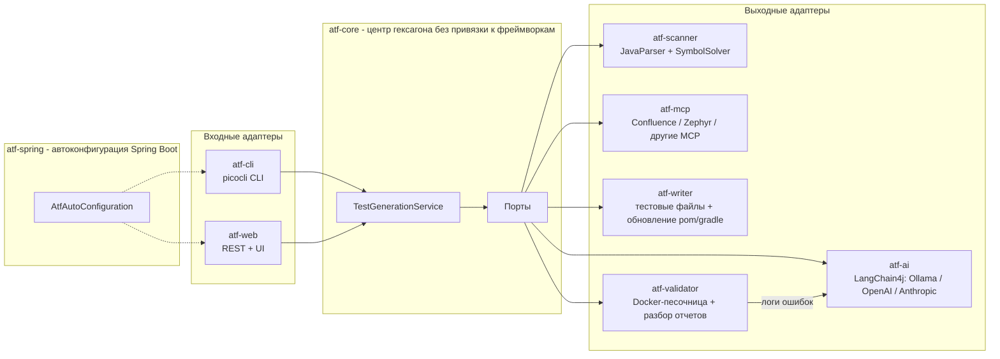

# AutoTestForge

**Генератор модульных и интеграционных тестов для Java-проектов на базе ИИ.**

AutoTestForge сканирует любой Maven- или Gradle-проект, анализирует исходный код на уровне AST и с помощью LLM генерирует осмысленные, готовые к запуску тесты JUnit 5 — включая моки Mockito, проверки AssertJ, позитивные и негативные сценарии, а также граничные случаи. Сгенерированные тесты можно выполнить в изолированной Docker-песочнице; ошибки передаются обратно модели для автоматического самоисправления.


## Как это работает



Пайплайн для каждого подходящего класса:

1. **Сканирование** — рекурсивно найти все корни `src/main/java` (с учетом multi-module-проектов), разобрать каждую единицу компиляции через JavaParser + SymbolSolver, извлечь публичный API, Javadoc, аннотации, зависимости класса и граф зависимостей внутри проекта.
2. **Отбор целей** — конкретные классы, enum и record с публичным поведением; интерфейсы, абстрактные классы, `@SpringBootApplication` и `@Configuration` пропускаются. Фильтры `--classes` / `--exclude` принимают простые и полные имена, а также шаблоны с `*` (`com.acme.service.*`, `*Service`). Классы, у которых уже есть тест `<Класс>Test`, по умолчанию **не перезаписываются** (статус `SKIPPED`), пока не передан `--overwrite`.
3. **Контекст проекта** — по графу зависимостей и сигнатурам публичных методов подбираются связанные типы проекта: коллабораторы, которые нужно замокать, и value-объекты/record, которые нужно сконструировать. Маленькие типы попадают в промпт целиком, большие — в виде публичного API, чтобы стабы и фикстуры компилировались.
4. **Внешний контекст** *(опционально)* — запросить бизнес-правила, требования и TMS test cases из настроенных MCP-источников (например, Confluence и Zephyr) по имени класса, package, методам и пользовательскому query template.
5. **Промпт** — system-сообщение с ролью и жесткими правилами плюс самодостаточный запрос: полный исходный код класса, сигнатуры методов с Javadoc, зависимости для мокирования, связанные типы, внешний бизнес/TMS-контекст, ограничения по стилю (Arrange-Act-Assert, именование `method_shouldX_whenY`, граничные случаи, сценарии ошибок).
6. **Генерация** — вызвать настроенную LLM через LangChain4j. Транспортные ошибки повторяются с экспоненциальной задержкой; ответ без валидного Java-кода отправляется обратно модели с просьбой исправить формат. Результат проверяется JavaParser, а пакет и имя класса приводятся к ожидаемым (`<пакет класса>.<Класс>Test`), даже если модель их проигнорировала.
7. **Запись** — поместить тест в `src/test/java/<package>/<Class>Test.java` соответствующего модуля и добавить недостающие тестовые зависимости в `pom.xml` / `build.gradle` / `build.gradle.kts` (для Gradle — также `useJUnitPlatform()` и `junit-platform-launcher`, без которых JUnit 5 не запускается).
8. **Валидация и самоисправление** *(опционально)* — запустить тест во временном Docker-контейнере (Testcontainers); в multi-module проектах собирается только владеющий модуль (`-pl ... -am` / `:module:test`). При ошибке разобрать JUnit XML-отчет, отправить ошибки обратно в LLM и повторить до `max-fix-attempts` раз. Если Docker недоступен, используется локальный запуск процесса с реальным таймаутом и ограниченным буфером вывода.

Классы можно обрабатывать параллельно (`--parallelism N`): вызовы LLM идут одновременно, запуски сборки сериализуются, поскольку делят `target/`. Ошибка в одном классе никогда не прерывает весь запуск — она записывается в итоговый отчет.

## Модули

| Модуль | Роль |
|---|---|
| `atf-core` | Доменная модель, порты, сервис оркестрации, форматтер отчетов (JSON / Markdown). Без зависимостей от фреймворков. |
| `atf-scanner` | Адаптер `ProjectScannerPort` на базе JavaParser (AST + разрешение символов). |
| `atf-ai` | Проектирование промптов, интеграция LangChain4j (Ollama, OpenAI-совместимые API, Anthropic), разбор и нормализация ответов, резервный автономный генератор. |
| `atf-mcp` | Подключение внешнего бизнес- и TMS-контекста через stdio MCP-серверы (например, Confluence, Zephyr). Одна сессия на источник на весь запуск. |
| `atf-writer` | Запись тестовых файлов (в проект или в отдельный каталог), поиск существующих тестов, `MavenPomUpdater` (Maven model API), `GradleBuildUpdater`. |
| `atf-validator` | Исполнитель тестов в Docker (Testcontainers), резервный запуск в локальном процессе, парсер JUnit XML-отчетов. |
| `atf-spring` | Автоконфигурация Spring Boot: единая точка сборки гексагона и настроек `atf.*` для CLI и web. Любой адаптер заменяется объявлением собственного bean. |
| `atf-cli` | Интерфейс командной строки на Spring Boot + picocli (`scan`, `generate`). |
| `atf-web` | Spring Boot REST API + одностраничный интерфейс: сканирование с выбором классов, прогресс в реальном времени, предпросмотр кода, отмена, отчеты. |

## Быстрый старт

Требования: JDK 17+, Maven 3.9+. Для LLM-генерации: локально запущенная [Ollama](https://ollama.com) (по умолчанию), API-ключ OpenAI / Anthropic или любой OpenAI-совместимый сервер. Для валидации в песочнице: Docker (опционально — при его отсутствии используется локальный запуск).

```bash
# собрать все модули
mvn -q package -DskipTests

# один раз скачать локальную модель по умолчанию
ollama pull llama3.1

# посмотреть, какие классы будут обработаны (без вызова LLM)
java -jar atf-cli/target/atf-cli-0.2.0.jar scan --project-path examples/demo-project --all

# сгенерировать тесты для встроенного demo-проекта
java -jar atf-cli/target/atf-cli-0.2.0.jar generate \
    --project-path examples/demo-project

# сгенерировать, провалидировать в Docker и самоисправить ошибки, параллельно по 4 класса
java -jar atf-cli/target/atf-cli-0.2.0.jar generate \
    --project-path examples/demo-project --validate --parallelism 4 --overwrite

# использовать OpenAI вместо локальной модели и сохранить отчеты
OPENAI_API_KEY=sk-... java -jar atf-cli/target/atf-cli-0.2.0.jar generate \
    --project-path examples/demo-project --llm openai \
    --report-json reports/atf.json --report-markdown reports/atf.md

# нет доступа к LLM? детерминированные автономные smoke-тесты прогоняют весь пайплайн
java -jar atf-cli/target/atf-cli-0.2.0.jar generate \
    --project-path examples/demo-project --llm offline --validate --overwrite

# посмотреть результат, не трогая проект: в консоль или в отдельный каталог
java -jar atf-cli/target/atf-cli-0.2.0.jar generate -p examples/demo-project --dry-run --print --overwrite
java -jar atf-cli/target/atf-cli-0.2.0.jar generate -p examples/demo-project --output-dir /tmp/generated --overwrite
```

Команды CLI: `scan` (предпросмотр целей) и `generate`. Общие опции:

| Флаг | Значение |
|---|---|
| `--project-path, -p` | Корень целевого проекта (обязательно) |
| `--classes, -c` | Фильтр классов через запятую: простые или полные имена, шаблоны с `*` и `?` |
| `--exclude, -x` | Исключить классы (тот же синтаксис), применяется после `--classes` |

Опции `generate`:

| Флаг | Значение |
|---|---|
| `--llm` | Переопределение провайдера на запуск: `ollama`, `openai`, `anthropic`, `offline` |
| `--validate` | Запустить сгенерированные тесты в песочнице и самоисправить ошибки |
| `--dry-run` | Сгенерировать без изменения целевого проекта |
| `--overwrite` | Перегенерировать классы, у которых уже есть тест (по умолчанию они пропускаются) |
| `--max-fix-attempts` | Количество раундов самоисправления на класс (по умолчанию 2) |
| `--parallelism, -j` | Сколько классов обрабатывать одновременно, 1–16 (по умолчанию 1) |
| `--output-dir, -o` | Писать тесты в этот каталог (с зеркалированием структуры модулей) вместо проекта |
| `--print` | Вывести исходники сгенерированных тестов в stdout |
| `--report-json`, `--report-markdown` | Сохранить отчет о запуске в файл (для CI, PR-комментариев, job summary) |
| `--with-external-context` | Перед генерацией искать бизнес/TMS-контекст через настроенные MCP-источники |
| `--context-sources` | Ограничить источники контекста списком через запятую, например `confluence,zephyr` |
| `--context-query` | Переопределить поисковый шаблон MCP на запуск (`${className}`, `${fullyQualifiedName}`, `${packageName}`, `${projectPath}`, `${methods}`) |
| `--atf.*=...` | Любая настройка из раздела «Конфигурация», например `--atf.validation.prefer-docker=false` |

Коды выхода: `0` — все обработанные классы успешны или пропущены, `1` — хотя бы один класс завершился ошибкой, `2` — запуск не удалось выполнить (проект не найден, нет сборочного файла и т.п.).

### Веб-интерфейс

```bash
java -jar atf-web/target/atf-web-0.2.0.jar
# открыть http://localhost:8080
```

Интерфейс ведет через три шага: параметры проекта → сканирование с выбором конкретных классов (видно, у каких уже есть тесты и почему остальные пропущены) → внешний контекст. Во время выполнения показываются прогресс-бар, журнал событий, таблица результатов с предпросмотром сгенерированного кода; задачу можно отменить, а отчет скачать в Markdown или JSON. Внизу — история недавних задач.

REST API:

| Метод | Путь | Назначение |
|---|---|---|
| `GET` | `/api/capabilities` | Доступные LLM-провайдеры, настроенные MCP-источники, значения по умолчанию |
| `POST` | `/api/scan` | Предпросмотр целей: `{ "projectPath", "classes", "excludes" }` |
| `POST` | `/api/generation` | Запуск асинхронной задачи (все опции `generate` плюс MCP-источники и файлы контекста) |
| `GET` | `/api/generation/{id}` | Состояние, события, результаты с исходниками тестов |
| `DELETE` | `/api/generation/{id}` | Кооперативная отмена: текущий класс завершается, остальные не начинаются |
| `GET` | `/api/generation/{id}/report?format=markdown\|json` | Скачать отчет |
| `GET` | `/api/generation` | Список задач (без исходников) |
| `POST` | `/api/mcp/tools` | Проверить MCP-сервер: запустить `{ "command", "args" }` и вернуть список его tools |

Ошибки домена возвращаются как RFC 9457 problem details (`422` для ошибок сканирования/сборки, `400` для неверных параметров).

## Внешний контекст через MCP

AutoTestForge может обогащать промпты бизнес-информацией и тестовыми артефактами из внешних систем через stdio MCP-серверы (транспорт соответствует спецификации MCP: JSON-RPC-сообщения, разделенные переводом строки; серверы с фреймингом `Content-Length` тоже поддерживаются). Это позволяет подключить, например, MCP-сервер Confluence для требований и MCP-сервер Zephyr для тест-кейсов из TMS. Каждый источник настраивается как команда запуска MCP-сервера и tool, который принимает поисковый аргумент. Процесс сервера запускается один раз на источник и переиспользуется для всех классов запуска.

```yaml
atf:
  context:
    enabled: true
    sources:
      - name: confluence
        enabled: true
        command: npx
        args: ["-y", "@your-org/confluence-mcp-server"]
        tool-name: search
        query-argument: query
        query-template: "Find requirements and business rules for ${fullyQualifiedName}. Methods: ${methods}"
        timeout: 30s
        max-chars: 8000
      - name: zephyr
        enabled: true
        command: npx
        args: ["-y", "@your-org/zephyr-mcp-server"]
        tool-name: search_tests
        query-argument: query
        query-template: "Find Zephyr test cases related to ${fullyQualifiedName}"
        timeout: 30s
        max-chars: 8000
```

После этого контекст можно включить для конкретного запуска:

```bash
java -jar atf-cli/target/atf-cli-0.2.0.jar generate \
    --project-path examples/demo-project \
    --with-external-context \
    --context-sources confluence,zephyr
```

Если MCP-источник недоступен, отвечает ошибкой или не укладывается в таймаут, генерация не прерывается: источник пропускается, а тесты генерируются по доступному контексту.

В Web UI можно не редактировать `application.yml`: добавьте MCP-источники прямо в форме запуска (кнопка «Проверить tools» покажет, какие инструменты предоставляет сервер) или загрузите XML/JSON/TXT экспорт из Zephyr/TMS. Источники из формы работают даже при `atf.context.enabled: false`. Загруженные файлы передаются в prompt как текстовый контекст; LLM должна использовать их для сценариев и добавить в тестовый класс JavaDoc-раздел `Business/TMS coverage` с краткой оценкой покрытых сценариев и пробелов.

## Конфигурация

Все настройки находятся под префиксом `atf.*`. Значения по умолчанию заданы в `atf-spring/src/main/resources/atf-defaults.properties`; переопределять их можно в `application.yml` приложения, переменными окружения (`ATF_LLM_PROVIDER=openai`) или флагами вида `--atf.llm.provider=openai`.

| Параметр | Значение по умолчанию | Описание |
|---|---|---|
| `atf.llm.provider` | `ollama` | Провайдер по умолчанию: `ollama`, `openai`, `anthropic`, `offline` |
| `atf.llm.temperature` | `0.2` | Температура сэмплирования (ниже = более детерминированные тесты) |
| `atf.llm.max-retries` | `3` | Повторные вызовы LLM с экспоненциальной задержкой при транспортных ошибках |
| `atf.llm.ollama.base-url` | `http://localhost:11434` | Адрес Ollama |
| `atf.llm.ollama.model` | `llama3.1` | Любая локальная модель (mistral, codellama, qwen2.5-coder, ...) |
| `atf.llm.openai.api-key` | `${OPENAI_API_KEY}` | Ключ OpenAI |
| `atf.llm.openai.base-url` | `${OPENAI_BASE_URL}` | Адрес OpenAI-совместимого API: Azure OpenAI, OpenRouter, Groq, DeepSeek, LM Studio, vLLM, llama.cpp. Провайдер `openai` регистрируется при наличии ключа **или** адреса |
| `atf.llm.openai.model` | `gpt-4o-mini` | Модель OpenAI / совместимого сервера |
| `atf.llm.anthropic.api-key` | `${ANTHROPIC_API_KEY}` | Ключ Anthropic; провайдер регистрируется только при его наличии |
| `atf.llm.anthropic.model` | `claude-sonnet-4-5` | Модель Claude |
| `atf.llm.anthropic.max-tokens` | `8192` | Максимальная длина ответа |
| `atf.generation.parallelism` | `1` | Классов, обрабатываемых одновременно (1–16) |
| `atf.generation.overwrite-existing` | `false` | Перегенерировать классы, у которых уже есть тест |
| `atf.validation.max-fix-attempts` | `2` | Раунды самоисправления на класс |
| `atf.validation.prefer-docker` | `true` | Использовать Docker, когда он доступен; иначе локальный процесс |
| `atf.validation.maven-image` | `maven:3.9-eclipse-temurin-17` | Образ песочницы для Maven-проектов |
| `atf.validation.gradle-image` | `gradle:8.10-jdk17` | Образ песочницы для Gradle-проектов |
| `atf.validation.timeout` | `15m` | Таймаут одного запуска сборки |
| `atf.context.enabled` | `false` | Включить статически настроенные MCP-источники контекста |
| `atf.context.sources[].command` | — | Команда запуска stdio MCP-сервера |
| `atf.context.sources[].tool-name` | — | MCP tool для поиска бизнес/TMS-информации |
| `atf.context.sources[].query-template` | встроенный шаблон | Поисковый шаблон с плейсхолдерами класса |

## Архитектурные заметки

- **Гексагональная архитектура.** `atf-core` содержит только домен и порты; каждая технология (JavaParser, LangChain4j, Docker, Spring) является адаптером. `atf-spring` собирает гексагон через автоконфигурацию с `@ConditionalOnMissingBean`, так что любое приложение может заменить адаптер одним собственным bean. Ядро полностью покрыто модульными тестами с моками портов.
- **Выход LLM не считается надежным.** Ответы должны разбираться как корректный Java-код (проверяется JavaParser); из нескольких блоков кода выбирается тот, где действительно есть тесты; пакет и имя класса нормализуются; неразбираемый ответ возвращается модели на исправление. Провайдеры находятся за слоем маршрутизации, поэтому переопределение `--llm` для отдельного запуска не требует перезапуска.
- **Контекст проекта вместо галлюцинаций.** Модель видит реальные определения коллабораторов и value-типов из того же проекта, что заметно снижает число некомпилируемых стабов и фикстур.
- **Детерминированный резервный режим.** Провайдер `offline` генерирует smoke-тесты на основе reflection без модели — это полезно в CI и для сквозной проверки всего пайплайна (CI этого репозитория прогоняет его с реальной валидацией через Maven).
- **Изоляция.** Сгенерированные тесты запускаются во временном контейнере с проектом, подключенным через bind mount, и постоянным кэшем зависимостей; инструменты хоста не используются, если доступен Docker. Без следов Docker на машине проба Testcontainers не выполняется вовсе.
- **Безопасность существующих тестов.** Тесты, написанные людьми, не перезаписываются без явного `--overwrite`; `--dry-run` и `--output-dir` позволяют оценить результат, не трогая проект.
- **Внешний контекст через порт.** Confluence, Zephyr и другие MCP/TMS-интеграции подключаются как адаптеры за `ExternalContextPort`; core получает только нормализованные фрагменты контекста и не зависит от конкретной внешней системы.
- **Обработка ошибок.** Отдельная иерархия исключений (`ScanException`, `LlmException`, `TestWriteException`, `ValidationException`) сохраняет ошибки на уровне классов; структурированное MDC-логирование (`projectPath`, `className`) позволяет отслеживать запуски в `logs/autotestforge.log`, в том числе при параллельной обработке.

## Разработка

```bash
mvn -B verify                 # сборка и все тесты
mvn -B -Pcoverage verify      # плюс отчеты JaCoCo в */target/site/jacoco
```

CI (GitHub Actions) собирает проект на JDK 17 и 21, а затем прогоняет CLI на demo-проекте: `scan`, `--dry-run` с отчетами, генерацию в `--output-dir` и полный цикл `--validate` в локальном процессе; Markdown-отчет публикуется в job summary.

## Планы развития

- Dogfooding: генерировать собственные интеграционные тесты AutoTestForge с помощью AutoTestForge.
- Генерация с учетом покрытия (цикл обратной связи JaCoCo для непокрытых веток).
- Интеграционные тесты между несколькими классами на основе графа зависимостей (сейчас связанные типы используются для unit-тестов одного класса).
- Интеграция Gradle Tooling API для точного добавления зависимостей.
- Потоковая передача прогресса в web (SSE) вместо опроса.

## Лицензия

[MIT](LICENSE)
