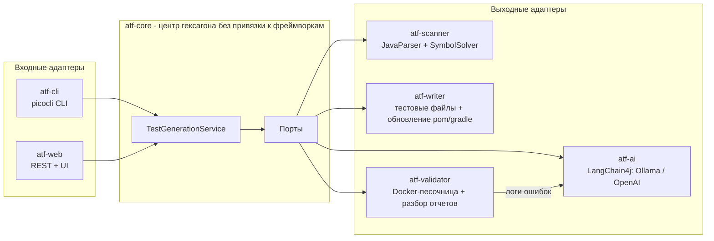

# AutoTestForge

**Генератор модульных и интеграционных тестов для Java-проектов на базе ИИ.**

AutoTestForge сканирует любой Maven- или Gradle-проект, анализирует исходный код на уровне AST и с помощью LLM генерирует осмысленные, готовые к запуску тесты JUnit 5 — включая моки Mockito, проверки AssertJ, позитивные и негативные сценарии, а также граничные случаи. Сгенерированные тесты можно выполнить в изолированной Docker-песочнице; ошибки передаются обратно модели для автоматического самоисправления.


## Как это работает



Пайплайн для каждого подходящего класса:

1. **Сканирование** — рекурсивно найти все корни `src/main/java` (с учетом multi-module-проектов), разобрать каждую единицу компиляции через JavaParser + SymbolSolver, извлечь публичный API, Javadoc, аннотации, зависимости класса и граф зависимостей внутри проекта.
2. **Промпт** — собрать самодостаточный промпт: полный исходный код класса, сигнатуры методов с Javadoc, зависимости для мокирования, ограничения по стилю (Arrange-Act-Assert, именование `method_shouldX_whenY`, граничные случаи, сценарии ошибок).
3. **Генерация** — вызвать настроенную LLM через LangChain4j; ответы повторяются с экспоненциальной задержкой и проверяются JavaParser (некомпилируемый результат отклоняется).
4. **Запись** — поместить тест в `src/test/java/<package>/<Class>Test.java` соответствующего модуля и добавить недостающие тестовые зависимости в `pom.xml` / `build.gradle` / `build.gradle.kts`.
5. **Валидация и самоисправление** *(опционально)* — запустить тест во временном Docker-контейнере (Testcontainers); при ошибке разобрать JUnit XML-отчет, отправить ошибки обратно в LLM и повторить до `max-fix-attempts` раз. Если Docker daemon недоступен, используется локальный запуск процесса.

Ошибка в одном классе никогда не прерывает весь запуск — она записывается в итоговый отчет.

## Модули

| Модуль | Роль |
|---|---|
| `atf-core` | Доменная модель, порты и сервис оркестрации. Без зависимостей от фреймворков. |
| `atf-scanner` | Адаптер `ProjectScannerPort` на базе JavaParser (AST + разрешение символов). |
| `atf-ai` | Проектирование промптов, интеграция LangChain4j (Ollama, OpenAI), разбор ответов, резервный автономный генератор. |
| `atf-writer` | Запись тестовых файлов, `MavenPomUpdater` (Maven model API), `GradleBuildUpdater`. |
| `atf-validator` | Исполнитель тестов в Docker (Testcontainers), резервный запуск в локальном процессе, парсер JUnit XML-отчетов. |
| `atf-cli` | Интерфейс командной строки на Spring Boot + picocli. |
| `atf-web` | Spring Boot REST API + одностраничный интерфейс с отображением прогресса в реальном времени. |

## Быстрый старт

Требования: JDK 17+, Maven 3.9+. Для LLM-генерации: локально запущенная [Ollama](https://ollama.com) (по умолчанию) или API-ключ OpenAI. Для валидации в песочнице: Docker (опционально — при его отсутствии используется локальный запуск).

```bash
# собрать все модули
mvn -q package -DskipTests

# один раз скачать локальную модель по умолчанию
ollama pull llama3.1

# сгенерировать тесты для встроенного demo-проекта
java -jar atf-cli/target/atf-cli-0.1.0.jar generate \
    --project-path examples/demo-project

# сгенерировать, провалидировать в Docker и самоисправить ошибки
java -jar atf-cli/target/atf-cli-0.1.0.jar generate \
    --project-path examples/demo-project --validate

# использовать OpenAI вместо локальной модели
OPENAI_API_KEY=sk-... java -jar atf-cli/target/atf-cli-0.1.0.jar generate \
    --project-path examples/demo-project --llm openai

# нет доступа к LLM? детерминированные автономные smoke-тесты прогоняют весь пайплайн
java -jar atf-cli/target/atf-cli-0.1.0.jar generate \
    --project-path examples/demo-project --llm offline --validate
```

Опции CLI:

| Флаг | Значение |
|---|---|
| `--project-path, -p` | Корень целевого проекта (обязательно) |
| `--classes, -c` | Фильтр классов через запятую (простые или полные имена классов) |
| `--llm` | Переопределение провайдера на запуск: `ollama`, `openai`, `offline` |
| `--validate` | Запустить сгенерированные тесты в песочнице и самоисправить ошибки |
| `--dry-run` | Сгенерировать без изменения целевого проекта |
| `--max-fix-attempts` | Количество раундов самоисправления на класс (по умолчанию 2) |

### Веб-интерфейс

```bash
java -jar atf-web/target/atf-web-0.1.0.jar
# открыть http://localhost:8080
```

`POST /api/generation` запускает асинхронную задачу, `GET /api/generation/{id}` транслирует ее прогресс; встроенный одностраничный интерфейс делает это за вас и показывает журнал событий в реальном времени и таблицу результатов.

## Конфигурация

Все настройки находятся под префиксом `atf.*` (`application.yml`, переменные окружения или флаги вида `--atf.llm.provider=...`):

| Параметр | Значение по умолчанию | Описание |
|---|---|---|
| `atf.llm.provider` | `ollama` | Провайдер по умолчанию: `ollama`, `openai`, `offline` |
| `atf.llm.temperature` | `0.2` | Температура сэмплирования (ниже = более детерминированные тесты) |
| `atf.llm.max-retries` | `3` | Повторные вызовы LLM с экспоненциальной задержкой |
| `atf.llm.ollama.base-url` | `http://localhost:11434` | Адрес Ollama |
| `atf.llm.ollama.model` | `llama3.1` | Любая локальная модель (mistral, codellama, ...) |
| `atf.llm.openai.api-key` | `${OPENAI_API_KEY}` | Ключ OpenAI; провайдер регистрируется только при его наличии |
| `atf.llm.openai.model` | `gpt-4o-mini` | Модель OpenAI |
| `atf.validation.max-fix-attempts` | `2` | Раунды самоисправления на класс |
| `atf.validation.prefer-docker` | `true` | Использовать Docker, когда он доступен; иначе локальный процесс |
| `atf.validation.maven-image` | `maven:3.9-eclipse-temurin-17` | Образ песочницы для Maven-проектов |
| `atf.validation.gradle-image` | `gradle:8.10-jdk17` | Образ песочницы для Gradle-проектов |

## Архитектурные заметки

- **Гексагональная архитектура.** `atf-core` содержит только домен и порты; каждая технология (JavaParser, LangChain4j, Docker, Spring) является адаптером, который можно заменить сменой одного bean-компонента. Ядро полностью покрыто модульными тестами с моками портов.
- **Выход LLM не считается надежным.** Ответы должны разбираться как корректный Java-код (проверяется JavaParser) до любых изменений целевого проекта; провайдеры находятся за слоем маршрутизации, поэтому переопределение `--llm` для отдельного запуска не требует перезапуска.
- **Детерминированный резервный режим.** Провайдер `offline` генерирует smoke-тесты на основе reflection без модели — это полезно в CI и для сквозной проверки всего пайплайна.
- **Изоляция.** Сгенерированные тесты запускаются во временном контейнере с проектом, подключенным через bind mount, и постоянным кэшем зависимостей; инструменты хоста не используются, если доступен Docker.
- **Обработка ошибок.** Отдельная иерархия исключений (`ScanException`, `LlmException`, `TestWriteException`, `ValidationException`) сохраняет ошибки на уровне классов; структурированное MDC-логирование (`projectPath`, `className`) позволяет отслеживать запуски в `logs/autotestforge.log`.

## Планы развития

- Dogfooding: генерировать собственные интеграционные тесты AutoTestForge с помощью AutoTestForge.
- Генерация с учетом покрытия (цикл обратной связи JaCoCo для непокрытых веток).
- Контекст на уровне репозитория (RAG по графу зависимостей) для интеграционных тестов между несколькими классами.
- Интеграция Gradle Tooling API для точного добавления зависимостей.

## Лицензия

[MIT](LICENSE)
