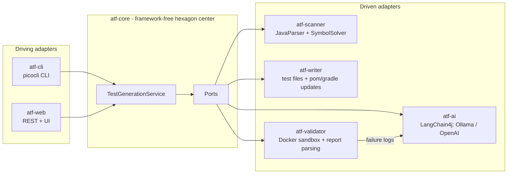

# AutoTestForge

**AI-powered unit & integration test generator for Java projects.**

AutoTestForge scans any Maven or Gradle project, analyzes its source code at the AST level and generates meaningful, ready-to-run JUnit 5 tests with an LLM — including Mockito mocks, AssertJ assertions, positive/negative scenarios and edge cases. Generated tests can be executed in an isolated Docker sandbox; failures are fed back to the model for automatic self-correction.


## How it works



The pipeline for every eligible class:

1. **Scan** — recursively locate every `src/main/java` root (multi-module aware), parse each compilation unit with JavaParser + SymbolSolver, extract the public API, Javadoc, annotations, collaborators and the intra-project dependency graph.
2. **Prompt** — build a self-contained prompt: full class source, method signatures with Javadoc, collaborators to mock, style constraints (Arrange-Act-Assert, `method_shouldX_whenY` naming, edge cases, error scenarios).
3. **Generate** — call the configured LLM through LangChain4j; responses are retried with exponential backoff and validated with JavaParser (non-compilable output is rejected).
4. **Write** — place the test in `src/test/java/<package>/<Class>Test.java` of the owning module and add any missing test dependencies to `pom.xml` / `build.gradle` / `build.gradle.kts`.
5. **Validate & self-correct** *(optional)* — run the test in a disposable Docker container (Testcontainers); on failure, parse the JUnit XML report, send the failures back to the LLM and retry up to `max-fix-attempts` times. Falls back to a local process run when no Docker daemon is available.

A failure for one class never aborts the run — it is recorded in the final report.

## Modules

| Module | Role |
|---|---|
| `atf-core` | Domain model, ports and the orchestration service. Zero framework dependencies. |
| `atf-scanner` | `ProjectScannerPort` adapter built on JavaParser (AST + symbol resolution). |
| `atf-ai` | Prompt engineering, LangChain4j integration (Ollama, OpenAI), response parsing, offline fallback generator. |
| `atf-writer` | Test file writer, `MavenPomUpdater` (Maven model API), `GradleBuildUpdater`. |
| `atf-validator` | Docker test executor (Testcontainers), local-process fallback, JUnit XML report parser. |
| `atf-cli` | Spring Boot + picocli command-line interface. |
| `atf-web` | Spring Boot REST API + single-page UI with live progress. |

## Quick start

Requirements: JDK 17+, Maven 3.9+. For LLM generation: [Ollama](https://ollama.com) running locally (default) or an OpenAI API key. For sandboxed validation: Docker (optional — falls back to a local run).

```bash
# build everything
mvn -q package -DskipTests

# pull the default local model once
ollama pull llama3.1

# generate tests for the bundled demo project
java -jar atf-cli/target/atf-cli-0.1.0.jar generate \
    --project-path examples/demo-project

# generate + validate in Docker + self-correct failures
java -jar atf-cli/target/atf-cli-0.1.0.jar generate \
    --project-path examples/demo-project --validate

# use OpenAI instead of the local model
OPENAI_API_KEY=sk-... java -jar atf-cli/target/atf-cli-0.1.0.jar generate \
    --project-path examples/demo-project --llm openai

# no LLM at hand? deterministic offline smoke tests exercise the whole pipeline
java -jar atf-cli/target/atf-cli-0.1.0.jar generate \
    --project-path examples/demo-project --llm offline --validate
```

CLI options:

| Flag | Meaning |
|---|---|
| `--project-path, -p` | Root of the target project (required) |
| `--classes, -c` | Comma-separated class filter (simple or fully qualified names) |
| `--llm` | Provider override for the run: `ollama`, `openai`, `offline` |
| `--validate` | Run generated tests in the sandbox and self-correct failures |
| `--dry-run` | Generate without touching the target project |
| `--max-fix-attempts` | Self-correction rounds per class (default 2) |

### Web UI

```bash
java -jar atf-web/target/atf-web-0.1.0.jar
# open http://localhost:8080
```

`POST /api/generation` starts an asynchronous job, `GET /api/generation/{id}` streams its progress; the bundled single-page UI does this for you with a live event log and a result table.

## Configuration

Everything lives under the `atf.*` prefix (`application.yml`, environment variables or `--atf.llm.provider=...` style flags):

| Property | Default | Description |
|---|---|---|
| `atf.llm.provider` | `ollama` | Default provider: `ollama`, `openai`, `offline` |
| `atf.llm.temperature` | `0.2` | Sampling temperature (low = deterministic tests) |
| `atf.llm.max-retries` | `3` | LLM call retries with exponential backoff |
| `atf.llm.ollama.base-url` | `http://localhost:11434` | Ollama endpoint |
| `atf.llm.ollama.model` | `llama3.1` | Any local model (mistral, codellama, ...) |
| `atf.llm.openai.api-key` | `${OPENAI_API_KEY}` | OpenAI key; provider registered only when present |
| `atf.llm.openai.model` | `gpt-4o-mini` | OpenAI model |
| `atf.validation.max-fix-attempts` | `2` | Self-correction rounds per class |
| `atf.validation.prefer-docker` | `true` | Use Docker when available, local process otherwise |
| `atf.validation.maven-image` | `maven:3.9-eclipse-temurin-17` | Sandbox image for Maven targets |
| `atf.validation.gradle-image` | `gradle:8.10-jdk17` | Sandbox image for Gradle targets |

## Design notes

- **Hexagonal architecture.** `atf-core` contains only the domain and ports; every technology (JavaParser, LangChain4j, Docker, Spring) is an adapter that can be swapped by changing one bean. The core is fully unit-tested with mocked ports.
- **LLM output is never trusted.** Responses must parse as valid Java (checked with JavaParser) before anything touches the target project; providers are behind a routing layer so a per-run `--llm` override needs no restart.
- **Deterministic fallback.** The `offline` provider generates reflection-based smoke tests without any model — useful in CI and for exercising the full pipeline end-to-end.
- **Isolation.** Generated tests run in a disposable container with the project bind-mounted and a persistent dependency cache; the host toolchain is never used unless Docker is unavailable.
- **Error handling.** A dedicated exception hierarchy (`ScanException`, `LlmException`, `TestWriteException`, `ValidationException`) keeps failures per-class; structured MDC logging (`projectPath`, `className`) makes runs traceable in `logs/autotestforge.log`.

## Roadmap

- Dogfooding: generate AutoTestForge's own integration tests with AutoTestForge.
- Coverage-guided generation (JaCoCo feedback loop targeting uncovered branches).
- Repository-level context (RAG over the dependency graph) for cross-class integration tests.
- Gradle Tooling API integration for precise dependency insertion.

## License

[MIT](LICENSE)
